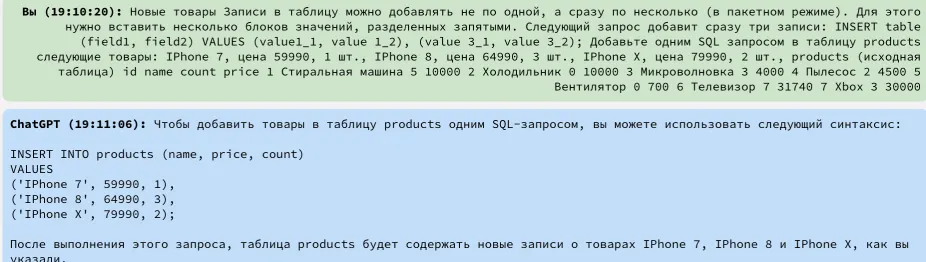
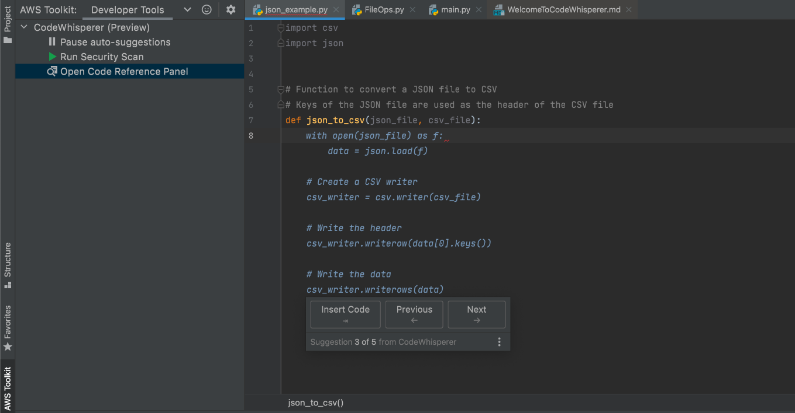

Демонстрация сервисов на основе машинного обучения (ML) для повышения производительности разработчиков путем создания рекомендаций по коду на основе их комментариев на естественном языке и кода в интегрированной среде разработки (IDE)

В 2023 году ИИ умеет не только отвечать на вопросы и рисовать картинки, но и писать код.

Получается пока с переменным успехом. Человека нейросеть сейчас не заменит, но результаты становятся все лучше, а используют ИИ-инструменты в разработке все чаще.

Чаще всего нейросети для кода поддерживают несколько языков программирования: Javascript, Java, C, C# и Python.

Это популярные варианты как среди начинающих, так и среди опытных разработчиков.

Расскажу про несколько ИИ-сервисов, которые умеют работать с кодом. Я проверил их на задачах из курсов для начинающих программистов, а заодно собрал отзывы о том, как нейросети показывают себя в реальной разработке.

Как нейросети работают с кодом

В обучении нейросеть ориентируется на огромный массив данных. В случае с ИИ для программирования алгоритм обучают на куче кусков кода, а уже потом программа пытается воссоздать его сама.

Обычные нейросети могут писать код, но им это дается тяжелее, чем специализированным аналогам: нейросеть не всегда понимает общую логику работы программы целиком, а еще у ChatGPT есть скрытые внутренние ограничения. При сложных запросах бот начинает рассказывать на естественном языке — чаще английском — о сложностях программирования и просит изменить запрос на понятный ему.

Задачи из курсов по введению в SQL первый попавшийся сайт с GPT⁠-⁠3.5 на борту решил с первого раза за секунды. Искать ответы через Google оказалось дольше

# подборка разнообразных AI-инструментов для разработчиков

За пределами всем известного GitHub Copilot лежит огромный мир полезных приложений для программистов, и каждую неделю в нем появляется что-нибудь новенькое. 

## Cody AI

Расширение Cody AI создано той же командой, что сделала SourceGraph. 

Cody AI загружает ваш репозиторий в базу SourceGraph, и каждый раз опирается на него, отвечая на ваши вопросы. 

Инструмент поддерживает много функций, которые здесь называются «рецепты». 

Например, вы можете выделить текст и попросить написать к нему комментарий в стиле JS. 

Или попросить «понюхать» выбранный кусок кода — и в ответ получите список, куда войдут не только необходимые фиксы, но и пункты «на подумать». Например, большое количество if в коде; если это вам не нравится, можно попросить оптимизировать код. 

В ответ вам не только предложат альтернативу, например, со switch, но и расскажут, почему она будет работать быстрее.

SourceGraph — это платный продукт, но Cody AI — бесплатный; сейчас, на ранней стадии продукта, единственное ограничение — это количество запросов к GPT 3.5, 250 в месяц. Cody AI экономичен в запросах и умело сжимает контекст, поэтому лимит получается не такой уж и маленький.

## Amazon CodeWhisperer

CodeWhisperer — аналог Copilot, созданный Amazon и почти не уступающий ему. 

Но при этом бесплатный. CodeWhisperer активно развивается, и если вы первый раз хотите попробовать AI-инструменты в работе, то это будет хорошим стартом, прежде чем вы решитесь на еще одну строчку расходов.

# Copilot Labs

`Amazon CodeWhisperer` — это передовой инструмент на базе искусственного интеллекта, предназначенный для повышения производительности разработчиков за счет предоставления предложений по коду в режиме реального времени. 

Он помогает оптимизировать процесс разработки программного обеспечения, генерируя фрагменты кода, целые функции и даже предлагает перевод на естественный язык для перевода bash для интерфейсов командной строки.

`Amazon CodeWhisperer`, предназначенный для разработчиков и программистов всех уровней, поддерживает широкий спектр языков программирования и легко интегрируется с различными `IDE` и инструментами командной строки, упрощая сложные задачи кодирования и повышая эффективность.

Ключевая особенность:

Предложения кода в режиме реального времени: предлагает мгновенную генерацию кода на основе комментариев пользователей и существующего кода.

Поддержка нескольких языков: совместимость с более чем 15 языками программирования, включая `Python, Java и JavaScript`.

Интеграция `IDE и CLI`: работает с популярными интегрированными средами разработки и интерфейсами командной строки.

Сканирование безопасности: выявляет потенциальные уязвимости безопасности в коде и предоставляет предложения по их устранению.

Интеграция с `Amazon Q`: интерактивный ИИ-помощник, который предоставляет экспертные рекомендации и пояснения к коду в `IDE`.

Параметры настройки: возможность настройки `CodeWhisperer` для внутренних `API`, библиотек и стандартов кодирования.

## Плюсы:

* Повышение производительности: участники конкурса производительности выполняли задачи на 57 % быстрее с помощью CodeWhisperer.

* Повышенное качество кода: предлагает рекомендации по передовому опыту и улучшениям безопасности.

* Простота использования: интуитивно понятный интерфейс, который естественным образом вписывается в рабочий процесс разработчика.

* Образовательная ценность: помогает новым и менее опытным разработчикам изучить шаблоны и методы кодирования.
 

## Минусы:

*Зависимость от подключения к Интернету: для предложений в режиме реального времени требуется стабильное подключение к Интернету.

*Потенциальная чрезмерная зависимость: риск того, что разработчики станут слишком полагаться на код, созданный ИИ.

*Кривая обучения. Новым пользователям может потребоваться время, чтобы эффективно интегрировать инструмент в существующий рабочий процесс.
 

Кто использует Amazon CodeWhisperer?

* Разработчики программного обеспечения: оптимизация процессов кодирования и повышение производительности.

* Команды DevOps: интеграция CodeWhisperer в конвейеры непрерывной интеграции и развертывания.

* Студенты, занимающиеся разработкой программного обеспечения: использование этого инструмента для изучения методов кодирования и синтаксиса языка.

* Специалисты по данным: использование этого инструмента в JupyterLab и Amazon SageMaker Studio для сценариев анализа данных.

* Необычные случаи использования: некоммерческие организации, оптимизирующие свои ограниченные ресурсы разработки; 

* Программисты-любители, использующие этот инструмент для личных проектов.
 

Цены:

Индивидуальный уровень: бесплатно для индивидуального использования, неограниченное количество предложений кода, отслеживание ссылок и 50 проверок безопасности в месяц.

Отказ от ответственности: наиболее точную и актуальную информацию о ценах можно найти на официальном веб-сайте Amazon CodeWhisperer.
 

Что делает `Amazon CodeWhisperer` уникальным?

`Amazon CodeWhisperer` отличается своим сложным искусственным интеллектом, который не только генерирует код, но также предоставляет объяснения и оценки безопасности.

Интеграция `Amazon Q`, помощника на базе искусственного интеллекта, который помогает понимать и преобразовывать код, является выдающейся функцией, которая возвышает этот инструмент над конкурентами.

 

Совместимость и интеграция:

Поддержка нескольких IDE: совместимость с VS Code, IntelliJ IDEA, Visual Studio (предварительная версия), AWS Cloud9 и другими.

Поддержка `CLI`: работает с терминалом `macOS, iTerm2` и встроенным терминалом `VS Code`.

Языки программирования: поддерживает множество языков, включая `Python, Java, JavaScript` и другие.

Настройка для внутреннего использования: возможность изучать свою кодовую базу для получения более релевантных предложений.

`Amazon` представила чат-бота под названием `Q`, которого предлагает использовать в качестве помощника в повседневных задачах разработчиков. 

Решение доступно в режиме предварительного просмотра и призвано стать конкурентом `ChatGPT`. 

algorithm

Сейчас чат-бот `Amazon Q` поддерживает:

ответы на вопросы и генерацию текста на общие темы.

В сгенерированном ответе будет подробное объяснение и ссылки на веб-сайты и материалы, которые помогут глубже изучить тему;ChatGPT

Из веб-приложения компания может попросить `Q` проанализировать, например, с какими функциями продукта сталкиваются ее клиенты и возможные способы их улучшения, или, как в `ChatGPT` , загрузить файл (документ Word, PDF, электронную таблицу и нравится) и задавать вопросы об этом файле. 

Q использует свои связи, интеграции и данные, в том числе данные, специфичные для бизнеса, чтобы давать ответы вместе с цитатами.

Q выходит за рамки простого ответа на вопросы. 

Помощник может генерировать или обобщать контент, такой как сообщения в блогах, пресс-релизы и электронные письма. 

И он выполняет действия от имени пользователя с помощью набора настраиваемых плагинов, таких как автоматическое создание заявок на обслуживание, уведомление определенных команд в Slack и обновление информационных панелей в ServiceNow.

Чтобы предотвратить ошибки, `Q` предлагает пользователям проверять действия, которые он собирается предпринять, перед их запуском и ссылаться на результаты для проверки.

Эти показатели делают `Amazon Q` сильным конкурентом аналогичных ИИ-помощников на рынке, а именно `Copilot для Microsoft 365 и Duet AI` для `Google Workspace`.

В заключение отметим, что `Amazon Q` представляет собой многофункциональный инструмент, предназначенный для оптимизации взаимодействия между предприятиями и `AWS`, а также с другими корпоративными системами. 

Благодаря своей конкурентоспособной ценовой структуре и широкому спектру возможностей Q выделяется как потенциально революционная инновация в индустрии услуг облачных вычислений.

Специализированные ИИ для разработки, даже на базе `ChatGPT`, обучаются на определенных данных, связанных с программированием и другими компьютерными технологиями. 

Они лучше натренированы на решение математических задач. 

Поэтому у подобных нейросетей получается писать код немного лучше, чем у общедоступных продуктов.

Вот что уже сейчас умеют ИИ-помощники для программистов:

проверяют уже написанный код. 

Нейросеть может указать на ошибки в синтаксисе и заодно выполнить тестирование программы;
дописывают код. 

ИИ можно попросить дополнить код, основываясь на той части программы, которую вы уже написали;
генерируют код с нуля. 

Программист может текстом описать задачу, а нейросеть сама напишет код;
пишут документацию. 

Можно попросить ИИ сделать комментарий — и он сам пояснит смысл написанного для другого программиста.

При составлении подборки нейросетей я ориентировался на несколько параметров, расскажу про них.

📖 Есть поддержка нескольких языков программирования. 

В целом нейросети умеют работать с большинством популярных вариантов. 

При этом навыки нейронок постоянно меняются, так что трудно выделить преимущества или недостатки конкретной системы в привязке к языку. В отдельном пункте я перечислил те языки, которые сами разработчики заявляют как наиболее хорошо освоенные.

😃 Можно попробовать даже без оплаты. 

Почти все сервисы из подборки можно использовать бесплатно, пусть и с ограниченными функциями. 

В остальных случаях есть тестовый период. 

Некоторые ИИ для кода безвозмездно доступны студентам.

🌎 Доступность в России. 

Все нейросети из списка можно использовать на территории РФ. 

С оплатой сложнее: ни один из сервисов не получится оплатить картой российского банка.

Остается либо искать иностранную карту, либо прибегать к услугам посредников. 

Последнее всегда сопряжено с рисками.

В этом тексте я не ставил цели найти лучший или худший ИИ-сервис для программирования. 

Задача — проверить работу базовых функций и то, доступны ли инструменты в России.

Лейбл заголовка

GitHub Copilot

Поддерживаемые языки: `Python, JavaScript, TypeScript, Ruby, Go, C#, C++`

Цена и условия использования: от 10 $⁣ (893 ₽) в месяц, есть 30-дневный пробный период

Доступность в России: работает, но оплата картой российского банка не проходит

В чем особенность: интегрирован с крупнейшим хранилищем ИТ-проектов и программ `GitHub`

Кому подойдет: тем, кому важна интеграция с `GitHub`

Разработчики позиционируют `Copilot` как помощника, который облегчит рутинные задачи. 

ИИ ищет решения в тысячах проектов на `GitHub` и предлагает варианты программисту. 

Теоретически человек сможет переложить на машину повторяющуюся работу: например, воспроизведение циклов, мелкие задания вроде несложных отборов данных из баз или специфические функции.

В `Copilot` есть инструменты для менеджмента разработки — управление сроками, задачами и ролями

В редактор кода `Copilot` устанавливается как один из дополнительных инструментов. 

Судя по отзывам, плагин лучше всего интегрирован в `Visual Studio от Microsoft`, но неплохо работает и с другими популярными средами разработки, например `IntelliJ IDEA и Neovim`.

Copilot постоянно анализирует вводимый код и предлагает до 10 своих вариантов. 

ИИ от `GitHub` умеет работать с комментариями и дописывать отдельные процедуры на их основе. 

Это стандартный и самый понятный сценарий работы. 

Принять или отклонить решение можно нажатием одной клавиши. 

ИИ предлагает разные варианты с учетом контекста задачи, но зачастую это громоздкие конструкции, которые свойственны новичкам.

Несложную задачу по генерации кода можно описать простым текстом. 

Аналогично устроена и работа с комментариями: ИИ смотрит, ищет закономерности и дальше уже предлагает код с их учетом. 

При работе на русском языке `Copilot` не всегда понимает, что от него хотят, на английском результат гораздо лучше.

`Copilot` часто ссылается на сторонние библиотеки для работы тех или иных функций. 

Это может помешать новичкам, которые еще не до конца понимают, откуда берутся некоторые инструменты или как их добавлять. Но сложностей можно избежать, если заранее ограничить помощника и запретить ему использовать любые сторонние библиотеки.

ИИ без проблем справляется с отдельными задачами из курсов по Python и Java, но иногда ошибается в технических деталях при решении более сложных проблем. 

Выглядит это так: `Copilot` находит в хранилищах `GitHub` максимально похожую задачу и переносит решение оттуда, при этом игнорируя нюансы.

А еще `Copilot` может конвертировать код из одного языка в другой и писать сложные SQL-запросы. 

Результаты лучше перепроверять, так как программа может упустить общую логику задачи. Зато ее использование защитит от ошибок в синтаксисе.

Студенты при регистрации в Copilot могут указать российские вузы или даже учреждения среднего профессионального образования

Чтобы начать использовать Copilot, надо авторизоваться по учетной записи GitHub и указать платежную информацию. 

Россия доступна в списке стран, но данные не сохранятся. 

Я использовал карту банка из Казахстана, а в интернете встречаются варианты с использованием виртуальных карт и криптовалюты.

Студенты и преподаватели могут пользоваться Copilot бесплатно.

 Для этого надо пройти проверку и получить доступ к GitHub Pro. 
 
 Опция доступна и учащимся российских учебных заведений. 
 
 При проверке достаточно заполнить заявку и приложить фото студенческого билета или зачетной книжки. 
 
 В документации нет конкретных требований к типу учебного заведения или специальности, как и других обязательных критериев получения подписки.

Плюсы	Минусы

Поддерживает популярные сложные языки программирования	Есть сложности с регистрацией из России

Легко устанавливается в адаптированные редакторы	Порой выходит за пределы задачи или инструментария

Стабильно работает	

Есть бесплатная версия для учащихся	

## Codeium

Поддерживаемые языки: более 70, но наиболее развиты C#, C, Python, CSS, Go, Groovy, Kotlin

Цена и условия использования: бесплатно для физических лиц

Доступность в России: работает без очевидных проблем

В чем особенность: бесплатный инструмент с поддержкой множества языков программирования

Кому подойдет: энтузиастам, которые хотят бесплатно автоматизировать рутинные небольшие задачи

Codeium разрабатывает калифорнийская компания Exafunction, которая специализируется на машинном обучении. Сервис построен на собственных разработках, о которых авторы не распространяются. На официальном сайте указано, что частично в модели используются наработки OpenAI, но процесс обучения индивидуален.

В отличие от Copilot, Codeium позиционируется как помощник, который допишет код сам или найдет необходимые программисту инструменты в собственном хранилище. Пользователь пишет запрос на английском языке, а ИИ ищет и предлагает варианты.

Видно, как Codeium дополняет запрос, быстро сориентировавшись, что я хочу описать программу-калькулятор. Потом ИИ запутался, два раза предложив одну функцию
Видно, как Codeium дополняет запрос, быстро сориентировавшись, что я хочу описать программу-калькулятор. Потом ИИ запутался, два раза предложив одну функцию
Похожие фичи есть и в других продвинутых редакторах кода: например, технология IntelliSense в Microsoft Visual Studio или автодополнение в PyCharm от JetBrains. Но у Codeium новые методы обучения на основе ИИ.

Встроить Codeium можно в большинство популярных редакторов кода. На официальном сайте есть подробные инструкции с примерами использования. Обычно требуется только установить плагин и авторизоваться через него. Также на сайте есть «игровая площадка», в которой можно попробовать написать код на нескольких популярных языках программирования и проверить, как ИИ поможет с этим.

Отличия платной версии Codeium от бесплатной не очень большие и связаны с работой инструмента в больших проектах
Отличия платной версии Codeium от бесплатной не очень большие и связаны с работой инструмента в больших проектах
Codeium хорошо справляется с простыми задачами на Python и Kotlin — почти всегда выдает верный или близкий результат. Программа старается не усложнять код, а использовать простые конструкции, но иногда из-за этого страдает общее качество. Порой Codeium может перестараться и сделать инструменты тестирования для слишком простой задачи. Например, проверку наполнения уникальной выборки из списка.

Над более сложными запросами ИИ надолго задумывается. И предлагает либо нерабочие варианты, либо слишком тяжелые — комплексную задачу описывает множеством простых команд. Работают такие конструкции медленно и ненадежно. Так сложный код пишут новички.

Иногда программа не дает никаких вариантов, при этом найти закономерность в том, когда это происходит, мне не удалось. Решить проблему помогает повторный ввод начала кода или комментария.

На сайте разработчиков Codeium есть сравнительный рейтинг с роликами, где их ИИ на голову выше аналогов. Периодическое молчание инструмента подтвердить такой вывод не дает
На сайте разработчиков Codeium есть сравнительный рейтинг с роликами, где их ИИ на голову выше аналогов. Периодическое молчание инструмента подтвердить такой вывод не дает
Codeium не умеет работать со сторонними библиотеками, поэтому придется разбираться самостоятельно. Также надо учитывать, что этот ИИ смотрит только в открытый в редакторе кода файл, поэтому его возможности сильно ограничены. Задавать контекст проекта лучше всего комментариями, но это не панацея.

Пользователи Codeium отмечают, что инструмент неплохо генерирует базовую документацию к коду. Программа почти не ошибается с содержанием комментариев, а мелкие ошибки можно поправить быстрее, чем писать текст с нуля.

ИИ-ассистент бесплатен для физических лиц. По словам создателей, такова философия их продукта. Основной доход разработчикам приносит корпоративная версия инструмента. Узнать ее цену не удалось: на запрос через форму обратной связи никто не ответил.

Плюсы	Минусы
Умеет работать с множеством языков программирования	Непрозрачная техническая часть
Легко встраивается в большинство редакторов кода	Иногда не выдает никаких результатов
Полностью бесплатно для рядовых пользователей	Умеет работать только с одной задачей за раз
Лейбл заголовка
Tabnine
Поддерживаемые языки: C#, C, Python, PHP, Ruby, Kotlin
Цена и условия использования: от 12 $⁣ (1071 ₽) в месяц, есть пробный период 14 дней, бесплатный тариф с серьезными ограничениями для рядовых пользователей
Доступность в России: работает, но оплата картой российского банка не проходит
В чем особенность: программа заточена под обучение на корпоративной базе знаний
Кому подойдет: тем, кто работает в корпоративной среде, где есть свое изолированное хранилище для программ и кода

В основе Tabnine лежал ChatGPT второго поколения, но сейчас сервис работает на собственных технологиях, в которые интегрированы наработки GPT-3.5. ИИ обучается на различных хранилищах, включая GitHub, но заточен под корпоративное использование.

Принцип работы — как и у конкурентов: программа анализирует код и предлагает варианты. Главное отличие в том, что корпоративный Tabnine можно отдельно развернуть в инфраструктуре или в облаке. Тогда у программы появляются централизованные средства управления, ее можно обучить на конкретном хранилище данных. Это улучшает качество предлагаемого кода: он более точно соответствует корпоративным стандартам.

Разработчики делают особую ставку на приватность. Они утверждают, что Tabnine обучается на всех доступных проектах, но никогда не хранит готовые модели данных и не будет применять их в явном виде
Разработчики делают особую ставку на приватность. Они утверждают, что Tabnine обучается на всех доступных проектах, но никогда не хранит готовые модели данных и не будет применять их в явном виде
Бесплатный тариф позволяет попробовать дополнения к коду, которые ограничены внутренними возможностями программы. При этом писать запросы на обычном языке, который программа обработает и превратит в код, можно только в платной версии.

Самостоятельно проверить корпоративные функции сложно, поскольку понадобится полновесное хранилище с кодом и хотя бы несколько разработчиков.

Tabnine работает с большинством популярных редакторов кода. Также к плюсам можно отнести полноценную поддержку самых популярных фреймворков и библиотек: React для JavaScript, Sass для CSS и Matlab для технических вычислений.

Несложные задачи Tabnine решает хорошо. Иногда программа требует больше контекста, но это неудивительно, учитывая ее специализацию. Также утилита порой делает слишком сложные тесты, которые при этом не помогают проверить правильность решения первоначальной задачи.

Разработчики часто обновляют блог: в нем они рассказывают новичкам, как начать работу, а опытным пользователям — как улучшить навыки
Разработчики часто обновляют блог: в нем они рассказывают новичкам, как начать работу, а опытным пользователям — как улучшить навыки
Сложные задачи на Python Tabnine решает успешно, но не всегда с первого раза. Программа очень быстро выдает результат, но код может быть полностью нерабочим или содержать ошибки, которые надо поправить вручную.

Пользователи Tabnine отмечают, что ИИ часто не понимает их. Например, есть проблемы с написанием комментариев к коду: в ответ на такой запрос программа может просто замолчать. Также не всегда срабатывает перевод с одного языка программирования на другой: ИИ-помощник просто копирует старый код, как будто выполнив задачу.

Плюсы	Минусы
Есть инструменты для централизованной корпоративной разработки	Непрозрачная техническая часть
Повышенная защищенность модели и пользовательских данных	Спорная полезность для рядовых пользователей
Есть поддержка популярных технологий	Иногда не выдает никаких результатов
Периодически не понимает пользователя
Лейбл заголовка
Amazon CodeWhisperer
Поддерживаемые языки: Python, Java, JavaScript, C#, Rust
Цена и условия использования: от 19 $⁣ (1696 ₽) в месяц, есть бесплатный тариф с небольшими ограничениями
Доступность в России: работает, но оплата картой российского банка не проходит
В чем особенность: новый сервис от ИТ-гиганта Amazon, в котором есть инструменты интеграции с другими продуктами компании
Кому подойдет: тем, кто работает с другими продуктами Amazon и уделяет внимание безопасности кода

Amazon разрабатывает свой ИИ для написания кода уже несколько лет, а в 2023 году сделала инструмент доступным для всех желающих. Компания не уточняет, какие конкретно модели использует для обучения CodeWhisperer.

Главная особенность — интеграция с другими инструментами от Amazon. CodeWhisperer предлагает не только код, но и сервисы, которые подойдут для работы создаваемой программы. ИИ распознает команды, которые могут быть связаны с инфраструктурой Amazon, например короткой командой можно попросить создать облачное хранилище S3.

CodeWhisperer бесплатен для рядовых пользователей, а сайт переведен на русский язык. Документации на русском при этом нет
CodeWhisperer бесплатен для рядовых пользователей, а сайт переведен на русский язык. Документации на русском при этом нет
CodeWhisperer интегрирован в облачный редактор кода AWS Cloud9 и сервис-редактор AWS Lambada. В других системах он работает как часть инструментария AWS Toolkit. ИИ от Amazon доступен для многих популярных редакторов кода, но не для Visual Studio.

Компания отдельно делает акцент на сканировании безопасности кода. ИИ ищет уязвимости, которые сразу предлагает исправить. Эта функция бесполезна в простых и изолированных задачах, но хорошо помогает разработчикам в комплексных проектах. ИИ спасает от непреднамеренных ошибок, которые потом тяжело будет исправлять. Бесплатно доступно 50 сканирований, в платной версии — 500.

В простых задачах CodeWhisperer предлагает до пяти очень похожих друг на друга вариантов дальнейшего кода. ИИ не замолкает, как некоторые его конкуренты, но иногда задумывается на 10—15 секунд. CodeWhisperer также справляется с написанием простых тестов и не пытается самостоятельно дополнить задачу.

В более сложных запросах ИИ хорошо понимает контекст, с чем у конкурентов порой возникают проблемы. При этом программа достаточно настойчиво предлагает использовать фрагменты инфраструктуры Amazon, например облачное хранилище S3. Порой CodeWhisperer вставляет в код лишние конструкции, которые приходится убирать вручную.

CodeWhisperer стал доступен для всех желающих c апреля 2023 года и пока не сильно раскручен. В интернете об инструменте в основном хорошие отзывы, но пользователи жалуются на малое количество поддерживаемых языков программирования и отсутствие интеграции с некоторым популярными редакторами кода.

Плюсы	Минусы
Бесплатно для рядовых пользователей без серьезных ограничений	Непрозрачная техническая часть
Есть встроенный анализатор безопасности кода	Нет поддержки некоторых популярных редакторов кода
Стабильно работает	Меньше поддерживаемых языков, чем у конкурентов
Лейбл заголовка
AskCodi
Поддерживаемые языки: Python, C, Java, JavaScript, Lua, Rust
Цена и условия использования: от 8,3 $⁣ (741 ₽) в месяц, есть бесплатный тариф с ограничениями
Доступность в России: работает, но оплата картой российского банка не проходит
В чем особенность: чат-бот для программистов, можно встроить в любую часть разработки
Кому подойдет: тем, кто ищет альтернативу поисковику или хороший черновик для кода

AskCodi отличается от других продуктов в подборке. Именно этот сервис больше других похож на чат-бот для программистов. Его не обязательно встраивать в редактор кода — ключевые фичи доступны из браузера. Внутри у него механизмы от OpenAI, но разработчики применяют собственные методы обучения.

Типовой сценарий для AskCodi: разработку можно вести в нескольких редакторах или в одном, но на разных языках, а утилиту использовать как справочник. Программа поддерживает популярные среды разработки, список постоянно пополняется. В некоторые, например Visual Studio или IntelliJ IDEA, AskCodi встраивается как расширение.

Работать с AskCodi через браузер удобно. В правой части экрана видно, как инструментом быстрых ответов ИИ сгенерировал код программы-калькулятора на Python
Работать с AskCodi через браузер удобно. В правой части экрана видно, как инструментом быстрых ответов ИИ сгенерировал код программы-калькулятора на Python
В сервисе AskCodi два основных инструмента: чат и «рабочая тетрадь». Через чат боту можно задавать вопросы об оптимальности кода, попросить найти ошибку или преобразовать отдельные процедуры или функции.

У ИИ нет контекста всего проекта, поэтому порой в тестах он выдает слишком простые варианты. А если дать слишком много информации, то бот может замолчать или выдать что-то совсем мимо задачи. При этом AskCodi хорошо справляется с изолированными задачами и SQL-запросами. В целом, работа программы по эффективности напоминает Codeium с аналогичными механиками внутри.

«Рабочая тетрадь» — куда более любопытный инструмент. Это «игровая площадка», примерно как у Codeium, где можно попросить ИИ сгенерировать код на одном из двух десятков языков, объяснить его или написать комментарий. Иногда программа сбоит или выдает бессмыслицу. Тогда процесс можно перезапустить или написать в чат, что код не рабочий. AskCodi может предложить другие варианты, а может и повторить ошибочный.

К простейшей функции на Python ИИ дал понятный комментарий, но затем пустился в тестирование, которое продолжалось несколько минут
К простейшей функции на Python ИИ дал понятный комментарий, но затем пустился в тестирование, которое продолжалось несколько минут
В сервисе есть перевод кода с одного языка в другой. Работает функция нестабильно. В моих запросах некоторые сложные функции AskCodi переделал корректно, но на достаточно простых задачах застревал. Несколько раз ИИ просто замолкал и оживал только после обновления страницы в браузере.

У сервиса удобный и дружелюбный интерфейс, но работает сайт не очень стабильно. Проблемы начинаются на этапе регистрации: войти через Google или GitHub у меня не вышло. Некоторые окна не открывались в свежем Chrome без надстроек, поэтому приходилось несколько раз обновлять страницу.

В бесплатном тарифе AskCodi доступно 50 операций в месяц, они называются токенами. За каждый запрос списывается один токен, даже если он закончился ошибкой или прервался. В платном тарифе доступно 500 токенов на 30 дней.

Плюсы	Минусы
Рабочий чат-бот для программистов	Частые мелкие технические проблемы
Можно экспериментировать с разными языками без установки редактора кода	Несправедливая система списания токенов за операции
Функции объяснения и комментирования работают и могут быть полезны новичкам	